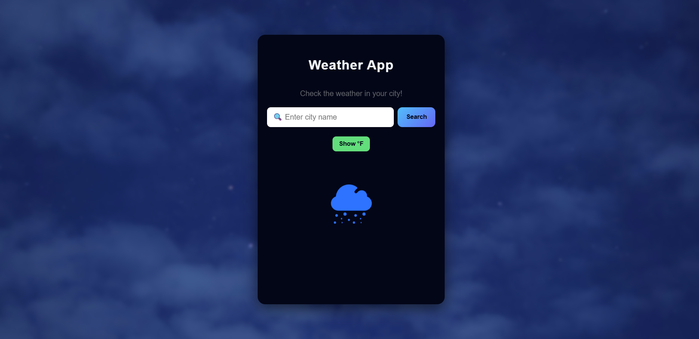

# Weather App

A modern and responsive weather application built with HTML, CSS, and JavaScript.

##  Features
- Search weather by city name
- Real-time weather data (OpenWeather API)
- Celsius / Fahrenheit toggle
- Animated weather icons
- Clean blue-black UI
- Fully responsive design

##  Tech Stack
- HTML5
- CSS3
- JavaScript (Fetch API)
- OpenWeather API

##  Live Demo
https://your-site-name.netlify.app

##  Preview

## Author
Omer Abubeker
